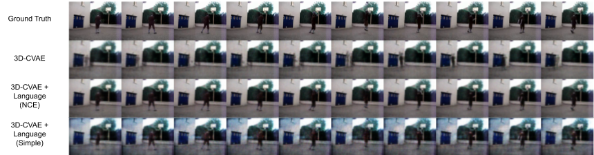
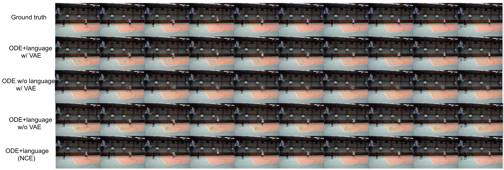

# Language-aided Video Prediction from a Single Image
Our objective is to do video prediction based on only single input image. To this end, we propose a method of 'Language aided Video Prediction from Single image' (LVPS). We extract language features from VisualCOMET to predict the context information given single image. Combined with the video generation backbone (Ordinary Differential Equation and 3D convolutional VAE), we generate sharper and temporally coherent videos from a single shot of the image compared to the methods without language information. We explore two different ways to associate language and video features during video prediction, in which we found Noise Contrastive Estimation (NCE) contrastive loss plays important role in predicting a high quality video with less uncertainty that is introduced by single input image. Then, we compare different video prediction methods both qualitatively and quantitatively.

## Getting Started
### Prerequisite
 - Linux Environment
 - Python 3
 - PyTorch 1.7.0
 - torchdiffeq ([https://github.com/rtqichen/torchdiffeq](https://github.com/rtqichen/torchdiffeq))
 - opencv-python
 - scikit-image
 -  CPU or NVIDIA GPU + CUDA CuDNN 10.1

### Installation
- Clone the repo
```
git clone -b master https://github.com/muchen2/LVPS.git
cd LVPS
```
- Install dependencies
```
pip install -r requirement.txt
```
- Install torchdiffeq
```
pip install torchdiffeq
```

### Model Training
Our video prediction models are trained on subset of UCF101 under the Basketball category. Our preprocessed data can be downloaded at [Google Drive link](https://drive.google.com/uc?export=download&id=1yIqm5dT11ZlFiQfRca6LL24sWghTQTID). 

- Create folder with name "data" under the LVPS project directory
- Copy downloaded ucf_basketball.zip into the data directory and extract the zip file at LVPS/data
-  To train the 3D-CVAE model and its variants, simply run
```
python train_cvae.py
```
- To train the VAE-ODE model and its variant, simply run
```
python train_ode.py
```
- Trained models and visualization of the prediction results will be saved in the current directory.

### Results
- 3D-CVAE prediction results

- VAE-ODE prediction results



